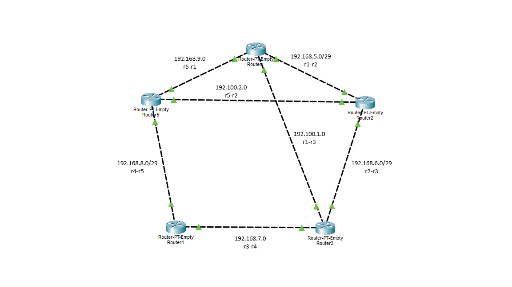

# Rede Virtual com Contêiners

Laboratório de roteamento dinâmico com FRRouting (FRR) rodando em containers Docker, simulando uma topologia de 5 roteadores.

## Topologia
Seguindo a ideia de uma topologia em anel, é formada por 5 roteadores conectados por link ponto a ponto e com dois links extras de redundância. Conforme a imagem abaixo:


## Pré-requisitos
- Docker Desktop instalado

## Instalação
1. Clone o repositório
```bash
git clone <url-do-repo>
cd roteamento-docker
```
2. Subir os containers
```bash
docker compose build
docker compose up -d
```
3. Conferir se os 5 containers estão de pé
```bash
docker ps
```
## Como aplicar um protocolo
Os scripts aplicar.bat/aplicar.sh copiam o daemons e o frr.conf para dentro de cada roteador e reiniciam o FRR.

Windows (CMD):
```cmd
aplicar.bat rip
```
```cmd
aplicar.bat ospf
```
Mac / Linux:
```bash
chmod +x aplicar.sh
./aplicar.sh rip
./aplicar.sh ospf 
```
Trocar de protocolo é só rodar o script de novo com o outro parâmetro, pois ele sobrescreve a configuração anterior em todos os roteadores.
## Verificar o funcionamento
Ver a tabela de rotas de um roteador:
```bash
docker exec R1 vtysh -c "show ip route"
```
Testar conectividade entre roteadores (ex.: R1 até a interface de R4):
```bash
docker exec R1 ping -c 4 192.168.7.3
```
```bash
docker exec R1 traceroute 192.168.7.3
```
Entrar no shell interativo do FRR de um roteador:
```bash
docker exec -it R1 vtysh
```
## Comandos úteis
- `docker compose down` - Derruba todos os containers e redes
- `docker restart R1` - Reinicia um roteador
- `docker exec R1 service frr status` - Confere se os daemons do FRR estão rodando
- `docker exec R1 ps aux` - Lista os processos ativos dentro do roteador
